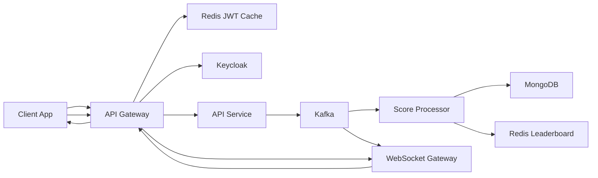
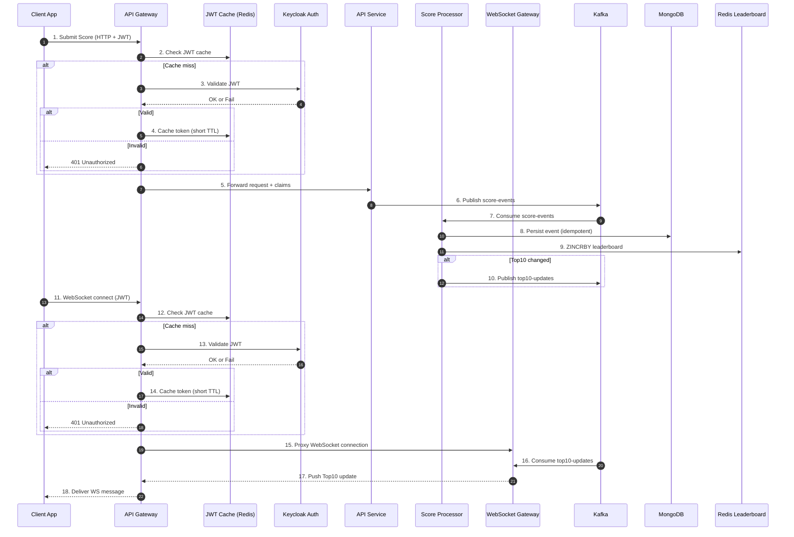

# Real-Time Leaderboard System – Improved Architecture

## Functional Requirements

- Display **Top 10 leaderboard** (API + realtime push).
- API to **increase score** when a user completes an action.
- **Anti-fraud measures**: JWT, rate limiting, idempotency.
- Record **event history**.

---

## Non-Functional Requirements

- End-to-end latency **≤ 300ms p95**.
- High throughput (**thousands of events/s**).
- **High Availability** and fault tolerance (Kafka replication).
- **Observability**: logs, metrics, tracing.

---

## System Architecture

---

## Event Flow

---

## Component Explanation

- **Client App**: Web/mobile client that submits scores and receives realtime leaderboard updates.
- **API Gateway**: Single entry point. Handles JWT validation (with Redis cache), rate limiting, routing, and WebSocket proxying.
- **JWT Cache (Redis)**: Stores token introspection results with short TTL to reduce Keycloak load.
- **Keycloak/Auth**: Issues and validates JWTs (OAuth2/OIDC). Gateway only calls it on cache miss.
- **API Service**: Stateless service that accepts validated requests, publishes `score-events` to Kafka.
- **Kafka**: Durable message broker. Decouples request submission from processing. Allows horizontal scaling with consumer groups.
- **Score Processor**: Consumes events from Kafka, writes to MongoDB, updates Redis sorted sets, and emits `top10-updates`.
- **MongoDB**: Persistent store for user scores and event history.
- **Redis Leaderboard**: Stores leaderboard in-memory for fast ZSET operations and queries.
- **WebSocket Gateway**: Subscribes to Kafka `top10-updates` and pushes updates back to clients via Gateway proxy.

---

## Scaling Strategy

- **Few thousand users**: Redis + RabbitMQ may suffice.
- **Hundreds of thousands of users**: Kafka becomes essential for throughput and durable event logs.
- **Horizontal scaling**:
  - API Gateway, API Service, Score Processor, and WS Gateway scale independently.
  - Kafka supports scaling via partitions & consumer groups.
  - Redis Cluster and MongoDB Sharding for larger data and higher throughput.

---

## Observability & High Availability

- **Logging & Metrics**: Use Prometheus/Grafana and centralized logging (ELK or Loki).
- **MongoDB**: Replica set.
- **Redis**: Cluster.
- **Kafka**: Replication factor ≥ 3 for fault tolerance.

---
